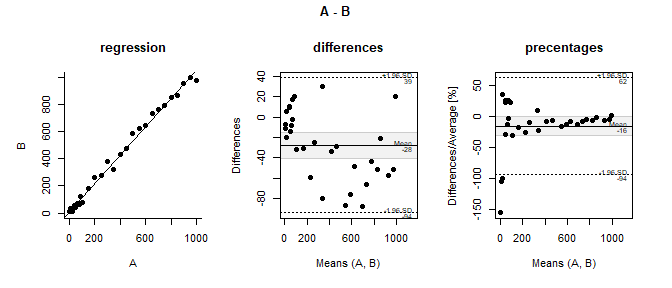
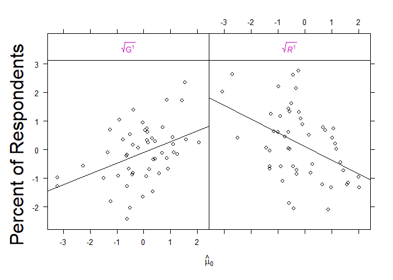
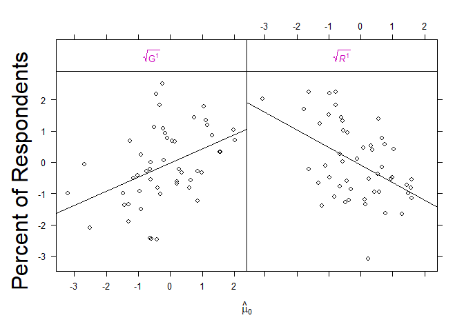
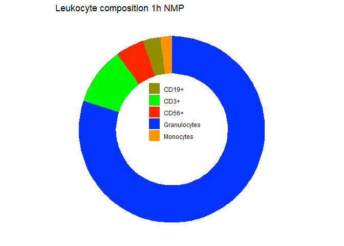
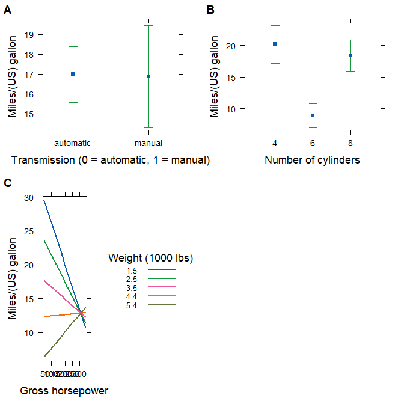

Untitled
================

## Funktionen

  - Theme for lattice-plots (Im Paket stp25output) set\_lattice(),
    set\_lattice\_ggplot(), set\_lattice\_bw(), reset\_lattice()
  - Boxplot bwplot2()
  - profile\_plot()
  - plot.bland\_altman()
  - Hilfsfunktionen wrap\_sentence(), stp25plot:::plot.efflist()

### set\_lattice()

Initialisieren der Lattice - Optionen mit set\_lattice(). Im Hintergrund
werden die latticeExtra::ggplot2like.opts() aufgerufen und die default
Werte in opar und oopt gespeichert um sie mit reset\_lattice() zurück
seten zu können.

``` r
reset_lattice()

p1<-barchart(xtabs(~treatment + sex + a,  DF), 
             auto.key=list(space="top", columns=3, 
                           cex=.7,
                           between=.7 ),
             par.settings= set_lattice()) 
p2<-barchart(xtabs(~ treatment + sex + a,  DF), 
             auto.key=list(space="top", columns=3, 
                           cex=.7,
                           between=.7 ),
             par.settings=set_lattice_bw()) 
p3<-barchart(xtabs(~ treatment + sex + a,  DF), 
             auto.key=list(space="top", columns=3, 
                           cex=.7,
                           between=.7 ),
             par.settings=set_lattice_ggplot()) 

grid.arrange(p1, p2, p3,   
             ncol=3)
```


Einbetten von set\_lattice() über update()

``` r
obj <-
  xyplot(
    Sepal.Length + Sepal.Width ~ Petal.Length + Petal.Width,
    iris,
    type = c("p", "r"),
    jitter.x = TRUE, jitter.y = TRUE,
    factor = 5,
    auto.key = list(
      cex.title = 1.2,
      title = "Expected Tau",
      text = c("30 ms", "80 ms", "130 ms", "180 ms"),
      space = "top"
      # lines = TRUE, rectangles = TRUE
    )
  )

obj <- update(obj, 
              legend = list(
                right =
                  list(fun = "draw.colorkey",
                       args = list(
                         list(at = 0:100)))))

## draw with custom.theme()
p1 <- update(obj, par.settings = custom.theme())
p2 <- update(obj, par.settings = set_lattice(theEconomist.theme()))
p3 <- update(obj, par.settings = set_lattice_bw(), axis = axis.grid)

grid.arrange(p1, p2, p3,
             ncol = 3)
```


### bwplot2

Lattice bwplot mit groups. Ist eine erweiterung von lattice::bwplot. Die
Funktion arbeitet mit panel.superpose.

``` r
p1 <- bwplot2(
  yield ~ site,
  data = barley,
  groups = year,
  auto.key = list(
    points = FALSE,
    rectangles = TRUE,
    space = "right"
  ),
  par.settings = set_lattice_bw(), main="bwplot2",
)

p2 <-
  bwplot(
    yield ~ site,
    barley,
    groups = year,
    auto.key = list(
      points = FALSE,
      rectangles = TRUE,
      space = "right"
    ),
    box.width = 1 / 4,
    par.settings = set_lattice_bw(), main="panel.superpose",
    panel = function(x, y, groups, subscripts, ...) {
      xx <- as.numeric(x) + scale(as.numeric(groups), scale = FALSE) / (nlevels(groups)+1)
      
      panel.superpose(
        xx,  y,  ...,
        panel.groups = panel.bwplot,
        groups = groups,
        subscripts = subscripts
      )
    }
  )


grid.arrange(p1, p2)
```


``` r
set_lattice_bw(col=c("gray80", "gray90")) 

bwplot(yield ~ site, data = barley, groups=year,
       pch = "|", box.width = 1/3,
       auto.key = list(points = FALSE, rectangles = TRUE, space = "right"),
       panel = panel.superpose,
       panel.groups = function(x, y, ..., group.number) {
         panel.bwplot(x + (group.number-1.5)/3, y, ...)
         mean.values <- tapply(y, x, mean)
         panel.points(x + (group.number-1.5)/3, mean.values[x], pch=17)
}


)
```

<!-- -->

``` r
  bwplot(
    yield ~ site,
    barley,
    groups = year,
    auto.key = list(
      points = FALSE,
      rectangles = TRUE,
      space = "right"
    ),
    box.width = 1 / 4,
    par.settings = set_lattice_bw(), main="panel.superpose",
    panel = function(x, y, groups, subscripts, ...) {
      xx <- as.numeric(x) + scale(as.numeric(groups), scale = FALSE) / (nlevels(groups)+1)

      panel.superpose(
        xx,  y,  ...,
        panel.groups = panel.mean,
        groups = groups,
        subscripts = subscripts
      )
panel.grid(h = -1, v = 0)
      # panel.stripplot(x, y, ..., jitter.data = TRUE,
      #                 groups = groups, subscripts = subscripts)
      # panel.superpose(x, y, ..., panel.groups = panel.average,
      #                 groups = groups, subscripts = subscripts)
      
      # panel.points(x, y, ..., panel.groups = panel.average,
      #              groups = groups, subscripts = subscripts)
     
    }
  )
```


### profile\_plot

``` r
profile_plot(x,
             highlight.col = 2,
             legend.n.col = 5)
```

    ##                                           A          B           C
    ## aufregend - langweilig           -1.4252474  0.3699992 -0.22007043
    ## gut gemacht - schlecht gemacht   -1.2231010 -0.1885835 -0.03454882
    ## glaubwürdig - unglaubwürdig      -0.1202374 -0.4797290  0.51085258
    ## spannend - eintönig               1.4440589 -0.8474767 -1.35826538
    ## verständlich - unverständlich    -0.9666228  0.3923676 -0.39961979
    ## guter Action - schlechter Action -1.1378613  1.3314717 -0.33334412
    ## sympathisch - unsympathisch       1.1018533 -0.7359814 -2.80254097
    ## talentiert - untalentiert         1.0038359  0.9677249  1.45521302
    ## modisch - unmodisch               0.7926149  0.1635893  0.29402771
    ## positive  - negative             -1.4113182 -1.2496463 -2.12929920
    ##                                            D          E
    ## aufregend - langweilig            0.65778658  0.7007676
    ## gut gemacht - schlecht gemacht    0.30443639 -1.3934243
    ## glaubwürdig - unglaubwürdig      -1.24252785  0.6537603
    ## spannend - eintönig               0.05297387  1.7615126
    ## verständlich - unverständlich    -0.35817203  0.4980426
    ## guter Action - schlechter Action  0.04906483 -0.6142885
    ## sympathisch - unsympathisch       0.79278829  0.3363034
    ## talentiert - untalentiert         0.65341253  0.2215069
    ## modisch - unmodisch               0.33830078 -0.3181428
    ## positive  - negative             -0.12137287  0.2456673

<!-- -->

    ## [1] TRUE

### MetComp\_BAP

Tukey Mean Difference oder auch Bland Altman Metode

``` r
x<- MetComp_BAP(~A+B, DF)
plot(x)
```

<!-- -->

## effect-plot

### Modifizier plot.efflist

``` r
A = rnorm(100)
B = rnorm(100)
C = factor(rep(c("This", "That"), 50))

ef <- allEffects(lm(A ~ B + C))
plot(ef, xlab = c("Foo", "Bar"), main="allEffects")
```

<!-- -->

``` r
plot.efflist <- stp25plot:::plot.efflist
ef <- allEffects(lm(A ~ B + C))
plot(ef, xlab = c("Foo", "Bar"), main="Modifiziert")
```

<!-- -->

## Effectplot mit emmeans

``` r
library(emmeans)
pigs.lm1 <- lm(log(conc) ~ source + factor(percent), data = pigs)
 ref_grid(pigs.lm1)
```

    ## 'emmGrid' object with variables:
    ##     source = fish, soy, skim
    ##     percent =  9, 12, 15, 18
    ## Transformation: "log"

``` r
pigs.lm2 <- lm(log(conc) ~ source + percent, data = pigs)
ref_grid(pigs.lm2)
```

    ## 'emmGrid' object with variables:
    ##     source = fish, soy, skim
    ##     percent = 12.931
    ## Transformation: "log"

``` r
plot(emmeans(pigs.lm1,  ~percent |source))
```

<!-- -->

``` r
emmip(pigs.lm1, source ~ percent)
```

<!-- -->

``` r
plot(emmeans(pigs.lm2,  
             ~ percent | source, 
             at = list(percent = c(10, 15, 20))
             ) )
```

<!-- -->

``` r
emmip(ref_grid(pigs.lm2, cov.reduce = FALSE), source ~ percent)
```

<!-- -->

``` r
emmip(ref_grid(pigs.lm2, at= list(percent = c(10, 15, 20))), source ~ percent)
```

<!-- -->

``` r
plot(Effect(c("source", "percent"), pigs.lm2,
            transformation=list(link=log, inverse=exp)
            ),multiline=TRUE,
     main="", ylab="conc") 
```

<!-- -->

``` r
emmip(ref_grid(pigs.lm2, 
               cov.reduce = FALSE, 
               transform = "response"), 
      source ~ percent)
```

<!-- -->

``` r
pigs.lm3 <- lm(log(conc) ~ source*percent, data = pigs)

plot(allEffects(pigs.lm3), main="", multiline=TRUE,
          key.args = list(space="right", columns=1, border=FALSE, fontfamily="serif", cex.title=.80, cex=0.75)
          )
```

<!-- -->

``` r
emmip(ref_grid(pigs.lm3, cov.reduce = FALSE), source ~ percent)
```

<!-- -->

## Interessante Grafik Beispiele

<https://ggobi.github.io/ggally/index.html>

### ggpubr

<http://www.sthda.com/english/articles/24-ggpubr-publication-ready-plots/78-perfect-scatter-plots-with-correlation-and-marginal-histograms/>

### Effect plots

``` r
fit <- lm(y ~ group * time * serum, DF)
```

library(effects) John Fox URL <http://www.jstatsoft.org/v32/i01/>

``` r
plot(effects::allEffects(fit)) 
```

<!-- -->

``` r
APA2(~log(prestige)+income+type + education, data=Prestige)
```

    ## 
    ##  Tab 1:  
    ##            Item Bezeichnung   n    Test Statistik
    ## 1 log(prestige)             102       3.77 (0.39)
    ## 2        income             102 6797.90 (4245.92)
    ## 3          type          bc  98          45% (44)
    ## 4                      prof              32% (31)
    ## 5                        wc              23% (23)
    ## 6     education             102      10.74 (2.73)
    ## 
    ## 

``` r
mod <- lm(log(prestige) ~ income:type + education, data=Prestige)

# does not work: effect("income:type", mod, transformation=list(link=log, inverse=exp))

plot(Effect(c("income", "type"), mod,
            transformation=list(link=log, inverse=exp)),
     main="", ylab="prestige") 
```

<!-- -->

``` r
set_lattice_bw()
plot(
  Effect(c("time", "group"), fit,
         partial.residuals = TRUE),
  main = FALSE,
  lty = 0,
  partial.residuals = list(pch = 16,
                           col = gray.colors(nrow(DF))[order(DF$serum)])
)
```

<!-- -->

library(jtools, interactions) Jacob A. Long

``` r
require(jtools)
```

    ## Loading required package: jtools

``` r
effect_plot(fit, pred = time, interval = TRUE, plot.points = TRUE)
```

<!-- -->

``` r
jtools::plot_summs(fit)
```

<!-- -->

``` r
require(interactions)
```

    ## Loading required package: interactions

``` r
#teract_plot(fit, pred = time, modx = group, plot.points = TRUE)

#plot(allEffects(fit), multiline=TRUE)
```

library(car)

``` r
car::residualPlots(fit) 
```

<!-- -->

    ##            Test stat Pr(>|Test stat|)
    ## group                                
    ## time                                 
    ## serum        -0.3948           0.6957
    ## Tukey test   -0.6940           0.4877

``` r
car::marginalModelPlots(fit) 
```

    ## Warning in mmps(...): Interactions and/or factors skipped

<!-- -->

``` r
car::avPlots(fit) 
```

<!-- -->

library(visreg) Patrick Breheny and Woodrow Burchett URL
<https://cran.r-project.org/web/packages/visreg/vignettes/quick-start.html>

``` r
par(mfrow=c(1,3))
visreg::visreg(fit)
```

    ## Conditions used in construction of plot
    ## time: 1
    ## serum: -0.215

    ## Conditions used in construction of plot
    ## group: Ctl_gt
    ## serum: -0.215

    ## Conditions used in construction of plot
    ## group: Ctl_gt
    ## time: 1

<!-- -->

library(stats)

``` r
par(mfrow=c(1,3))
stats::termplot(fit, 
                se = TRUE, 
                resid = TRUE, 
                plot=TRUE, ask=FALSE)
```

<!-- -->

library(rockchalk) Paul E. Johnson URL
<https://github.com/pauljohn32/rockchalk>

``` r
rockchalk::plotSlopes(fit, 
                      plotx = "group", 
                      interval = "confidence")
```

    ## Registered S3 method overwritten by 'kutils':
    ##   method       from     
    ##   print.likert stp25stat

<!-- -->

``` r
rockchalk::plotSlopes(fit, 
                      plotx = "group", 
                      modx = "time", 
                      interval = "confidence")
```

<!-- -->

`{ stripp-data, fig.height=5, fig.width= 5} raw_data <- data.frame(
subject_id = rep(1:6, 4)`

\`\`\`{ stripp2, fig.height=5, fig.width= 5} time =
as.factor(rep(c(“t0”, “t1”), each = 12)), group =
rep(rep(c(“Control”, “Treat”), each = 6), 2), value = c(2:7, 6:11,
3:8, 7:12) )

head(raw\_data)

stripplot( value \~ time | group, groups = subject\_id, data =
raw\_data, panel = function(x, y, …) { panel.stripplot(x, y, type = “b”,
col=“blue”, lty = 2, …) panel.average(x, y, fun = mean, lwd = 2, col =
“gray80”, …) \# plot line connecting means mm\<-mean(y)
panel.abline(h=mm, v=1.5, col=“gray80”) panel.text(x=1.5,y=mm,
APA(wilcox.test(y\~x)) )

} )

\`\`\`

``` r
 data(Chem97, package = "mlmRev")

 ecdfplot(~gcsescore | factor(score), data = Chem97,
     groups = gender, auto.key = list(columns = 2), subset = gcsescore >
        0, xlab = "Average GCSE Score")
```

<!-- -->

<http://www.sthda.com/english/articles/24-ggpubr-publication-ready-plots/78-perfect-scatter-plots-with-correlation-and-marginal-histograms/>
