Grafiken
================

## Funktionen

- Theme for lattice-plots set_lattice(), reset_lattice() und
  lattice::trellis.par.set(bw_theme(farbe()))
- auto_plot Einzelne lattice plots analog wie die Funktion Tabelle()
- Boxplot bwplot2()
- plot.bland_altman()
- Hilfsfunktionen wrap_sentence(), stp25plot:::plot.efflist()

<!-- badges: start -->

[](https://www.tidyverse.org/lifecycle/#experimental)
[](https://CRAN.R-project.org/package=stp25stat2)
<!-- badges: end -->

### ROC

``` r
require(pROC)
```

    ## Loading required package: pROC

    ## Type 'citation("pROC")' for a citation.

    ## 
    ## Attaching package: 'pROC'

    ## The following objects are masked from 'package:stats':
    ## 
    ##     cov, smooth, var

``` r
# roc1 <- pROC::roc(Group ~ Glu, data = DF_roc)
# Tbll_roc(roc1)
# plotROC2(roc1)
# plotROC2(Group ~ Glu, data = DF_roc, col = "red") 
roc.list <- pROC::roc(Group ~ Glu+Gln+Arg+Cys, data = DF_roc) 
```

    ## Setting levels: control = Control, case = Ill

    ## Setting direction: controls > cases

    ## Setting levels: control = Control, case = Ill

    ## Setting direction: controls < cases

    ## Setting levels: control = Control, case = Ill

    ## Setting direction: controls < cases

    ## Setting levels: control = Control, case = Ill

    ## Setting direction: controls < cases

``` r
#Tbll_roc(roc.list)
plotROC2(roc.list)  
```

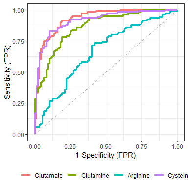<!-- -->

``` r
# Oder 
# plotROC2(Group ~ Glu + Gln + Arg + Cys, data = DF_roc) 
```

### Likertplot

Die Link-Plots habe ich in ein separates Paket ausgelagert. Dort sind
auch die Funktionen zur Erstellung der Tabellen enthalten.

``` r
library(stp25likert)
```

``` r
#Res1 <- Tbll_likert( ~ ., DF2[, -5])
Res2 <- Tbll_likert(. ~ Geschlecht, DF2)
```

    ## New names:
    ## New names:
    ## • `` -> `...8`

``` r
likertplot(Item ~ . | Geschlecht,
           data = Res2,
            between=list(x=0), columns=5)
```

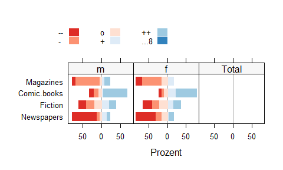<!-- -->

``` r
 # col = likert_col(attr(data, "plot")$nlevels, middle = ReferenceZero)
```

``` r
DF2 |> likert_plot(Magazines, Comic.books, Fiction, Newspapers, 
                    relevel = letters[1:5],
                    auto.key = list(columns=5, between=.15, space="top"),
                   # between=list(x=0),
                    horizontal=FALSE,
                    ReferenceZero = 1.5)
```

    ## New names:
    ## New names:
    ## • `` -> `...7`

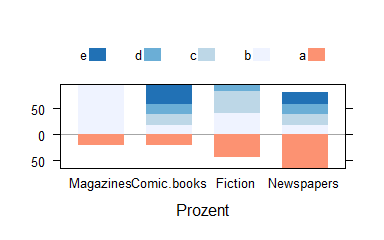<!-- -->

### Signifikanz-Plot

Der Fliegen-Schiss-Plot mein absoluter lieblings Plot!!

``` r
#dat1 <- Long(dat, DC4 ~ nmp + time2, value = "DC4")
#fit2 <- lmer(DC4 ~ time2 + (1 | nmp), data = dat1) 

fit1 <- lm(DC4 ~ time2, data = dat)
em1 <- emmeans(fit1, list(pairwise ~ time2), adjust = "tukey")
#em2 <- emmeans(fit2, list(pairwise ~ time2))
prism.plots(
  DC4 ~ time2,
  data = dat,
  #fun = mean,
  ylim = c(-8, 60)
)
plotSigBars(fit1)
```

<!-- -->

``` r
boxplot(  DC4 ~ time2,
          data = dat,
          ylim = c(-15, 70))

plotSigBars(fit1, stars=FALSE)
```

<!-- -->

``` r
#plotSigBars(em1, stars=FALSE)
```

``` r
#stripplot(  DC4 ~ time2,  data = dat, jitter.data=TRUE,pch=20, col="gray50")

stripplot(
  DC4 ~ time2,
  data = dat, ylim=c(-10,70),
  ylab = "Difference (Absolute Value) [mm]", jitter.data=TRUE,
  panel = function(x, y, ...) {
    # panel.conf.int(x, y, ...)
    panel.stripplot(x,y, pch=19, col="gray50",...)
    #panel.points(x,y, pch=19,...)
    #panel.mean(x,y,  ...)
    panel.median(x,y, ...)
    panel.sig.bars(fit1, include.stars = FALSE, offset = .4)
  }
)
```

<!-- -->

``` r
#require(latticeExtra)
#require(effects)
fit1 <- lm(DC4 ~ time2, data = dat)
 
p2<- plot(effect("time2", fit1), ylim=c(0,60))
p2 +  latticeExtra::layer( panel.sig.bars(fit1, include.stars = FALSE) )
```

<!-- -->

``` r
require(emmeans)
plot_differenz <-
  function (x, ...)
  {
    cis <- as.data.frame(confint(x))
    x <- as.data.frame(x)
    xx <-
      cbind(
        diff = cis$estimate,
        lwr = cis$lower.CL,
        upr = cis$upper.CL,
        p.value = x$p.value
      )
    row.names(xx) <- cis$contrast
    psig <- ifelse( x$p.value<.1, "black", "gray50")
    stats:::plot.TukeyHSD(list(x = as.matrix(xx)), col=psig, ...)
    xx
  }
op=par(mar=c(4.2, 5, 3.8, 2))
fit1 |>  
  emmeans("time2") |> 
  pairs() |>  
  plot_differenz(las = 1, xlim =c(15, -25)) 
```

<!-- -->

    ##                 diff       lwr       upr    p.value
    ## 1h - 4h    -4.567907 -14.16111  5.025301 0.67556397
    ## 1h - 6h    -8.430068 -18.02328  1.163140 0.11248355
    ## 1h - 12h  -11.339568 -21.46837 -1.210768 0.02027568
    ## 1h - 24h  -13.671896 -24.61063 -2.733167 0.00682780
    ## 4h - 6h    -3.862161 -13.33766  5.613334 0.78729677
    ## 4h - 12h   -6.771661 -16.78904  3.245721 0.33406688
    ## 4h - 24h   -9.103990 -19.93963  1.731654 0.14212665
    ## 6h - 12h   -2.909500 -12.92688  7.107883 0.92716613
    ## 6h - 24h   -5.241829 -16.07747  5.593815 0.66236834
    ## 12h - 24h  -2.332329 -13.64489  8.980236 0.97847868

``` r
par(op)
```

### Auto-Plot auto_plot()

Die Funktion klebt lattice- plots zu einer matrix zusammen.

Verwendung: auto_plot(formula, data) oder data \|\> auto_plot(var_x,
var_y, var_z) Die Funktion kann dabei Formel wie z.B. $a+b+c\sim g$

$a[box]+b[bar]+c[dot]\sim g$

$log(a) +b +c \sim g$

$y \sim a+b+c$

<https://www.zahlen-kern.de/editor/>

``` r
head(DF)
```

    ##          n        e        o        g a treatment  sex
    ## 1 1.739529 1.147474 4.570936 1.605641 2       UG1 male
    ## 2 3.809496 1.981164 2.206868 1.802296 3       UG2 male
    ## 3 3.293305 4.915539 3.220876 1.413948 3       UG2 male
    ## 4 1.672208 4.542949 4.020865 1.050647 3       UG1 male
    ## 5 4.775357 1.963932 4.825702 3.610156 3        KG male
    ## 6 4.773900 4.028846 4.817246 1.968159 2       UG2 male

``` r
DF |> auto_plot(
  n,
  e[box],
  o[hist],
  g,
  a,
  treatment,
  by =  ~ sex,
  par.settings = bw_theme()
)
```

<!-- -->

``` r
auto_plot(treatment ~ n + e + sex, DF)
```

<!-- -->

``` r
auto_plot(
  enviro2,
  ozone[hist],
  radiation,
  smell,
  temperature,
  by =  ~ is.windy,
  col.bar=  farbe("Blues")[3],
  ylab= c("ppb", "langleys",  "%",  "F"),
  include.percent=TRUE,
  wrap.main=30
 # levels.logical = c(TRUE, FALSE),
#  labels.logical = c("ja", "nein")
)
```

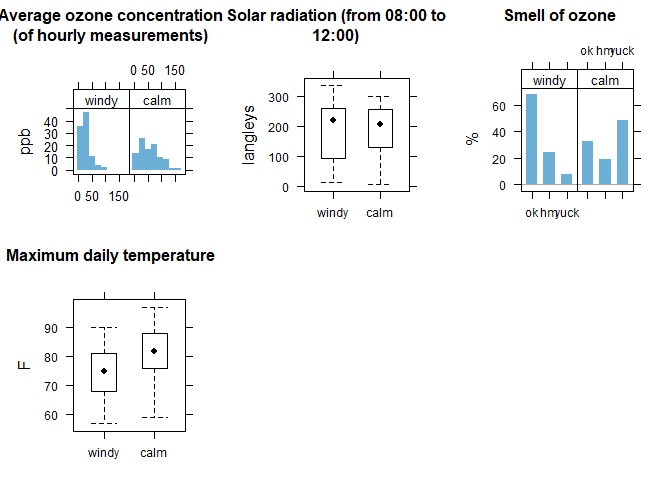<!-- -->

Mehrfachantworten mit multi_barplot().

``` r
# dat2[1:5] |> 
#   multi_barplot()
# 
# dat2 |>  
#   multi_barplot(. ~ gender,
#                 reorder = TRUE,
#                 last = c("Others" ))
# 
# dat2[1:5] |> 
#   auto_plot()
# 
# dat2 |>
#   auto_plot(. ~ gender)


# dat2 |>  auto_plot(comp_1, comp_2, comp_3 , 
#                     include.percent=TRUE,
#                     include.reorder=TRUE,
#                     main ="Complicationen",
#                     xlab= "Prozent")
```

### set_lattice()

~Initialisieren der Lattice - Optionen mit set_lattice(). Im Hintergrund
werden die latticeExtra::ggplot2like.opts() aufgerufen und die default
Werte in opar und oopt gespeichert um sie mit reset_lattice() zurück
seten zu können.~

     

``` r
reset_lattice()


lattice::trellis.par.set(bw_theme(farbe()))


p1<-barchart(xtabs(~treatment + sex + a,  DF), 
             auto.key=list(space="top", columns=3, 
                           cex=.7, between=.7 ),
             par.settings= standard_theme()) 
p2<-barchart(xtabs(~ treatment + sex + a,  DF), 
             auto.key=list(space="top", columns=3, 
                           cex=.7, between=.7 ),
             par.settings=bw_theme()) 
p3<-barchart(xtabs(~ treatment + sex + a,  DF), 
             auto.key=list(space="top", columns=3, 
                           cex=.7, between=.7 ),
             par.settings=ggplot_theme()) 

grid.arrange(p1, p2, p3, ncol=3)
```

<figure>
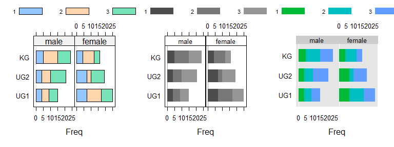
<figcaption aria-hidden="true">Plot mit grid.arrange - hier muss das
Theme mit par.settings= set_lattice() uebergeben werden</figcaption>
</figure>

Einbetten von set_lattice() über update()

``` r
obj <-
  xyplot(
    Sepal.Length + Sepal.Width ~ Petal.Length + Petal.Width,
    iris, type = c("p", "r"),
    jitter.x = TRUE, jitter.y = TRUE, factor = 5,
    auto.key = list(
      cex.title = 1.2,
      title = "Expected Tau",
      text = c("30 ms", "80 ms", "130 ms", "180 ms"),
      space = "top" # lines = TRUE, rectangles = TRUE
    ))

obj <- update(obj, 
              legend = list(
                right =
                  list(fun = "draw.colorkey",
                       args = list(list(at = 0:100)))))

p1 <- update(obj, par.settings = custom.theme( ))
p2 <- update(obj, par.settings = ggplot_theme())
p3 <- update(obj, par.settings = bw_theme(), axis = axis.grid)

grid.arrange(p1, p2, p3, ncol = 3)
```

<figure>
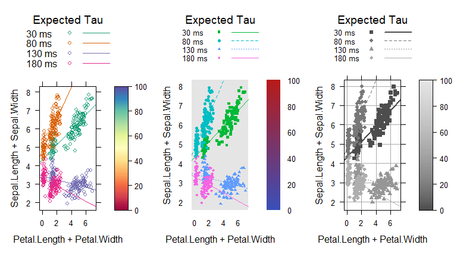
<figcaption aria-hidden="true">Plot mit grid.arrange und
update</figcaption>
</figure>

### strip Sonderzeichen + Größe

``` r
 x1<-rnorm(100);  x2<-gl(2, 50, labels = c("Control", "Treat"))
 y<-(1.5-as.numeric(x2))*x1+rnorm(100)
#windows(7,4)
p1<- xyplot(y~x1|x2,
            xlab = expression(hat(mu)[0]),
            type=(c("p", "r")),
            # - auch mit fontsize=20
            ylab=list(label="Percent of Respondents", cex=2),
            par.strip.text=list(lines=2.5, col=6),
            strip=strip.custom(factor.levels=
                                 expression(
                                   sqrt(G^{1}), sqrt(italic(R)^{1}))))
 print(p1)
```

<!-- -->

### bwplot2

Lattice bwplot mit groups. Ist eine erweiterung von lattice::bwplot. Die
Funktion arbeitet mit panel.superpose.

``` r
p1 <- bwplot2(
  yield ~ site,
  data = barley, groups = year, main="bwplot2()", par.settings = bw_theme(),
  auto.key = list(points = FALSE, rectangles = TRUE, space = "right")

)

p2 <-
  bwplot(
    yield ~ site,
    barley,groups = year, main="panel.superpose", par.settings = bw_theme(),
    auto.key = list(points = FALSE, rectangles = TRUE, space = "right"),
    box.width = 1 / 4,
    panel = function(x, y, groups, subscripts, ...) {
      xx <- 
        as.numeric(x) + scale(as.numeric(groups), scale = FALSE)/(nlevels(groups)+1)
      panel.superpose(
        xx,  y,  ...,
        panel.groups = panel.bwplot,
        groups = groups,
        subscripts = subscripts
      )
    }
  )


grid.arrange(p1, p2)
```

<figure>

<figcaption aria-hidden="true">Boxplot mit bwplot2() und
panel.superpose()</figcaption>
</figure>

``` r
bwplot(yield ~ site, data = barley, groups=year,
       pch = "|", box.width = 1/3,
       auto.key = list(points = FALSE, rectangles = TRUE, space = "right"),
       panel = panel.superpose,
       panel.groups = function(x, y, ..., group.number) {
         panel.bwplot(x + (group.number-1.5)/3, y, ...)
         mean.values <- tapply(y, x, mean)
         panel.points(x + (group.number-1.5)/3, mean.values[x], pch=17)
}


)
```

<figure>

<figcaption aria-hidden="true">Boxplot mit panel.bwplot() und
panel.superpose()</figcaption>
</figure>

``` r
  bwplot(
    yield ~ site,
    barley, groups = year, main="panel.superpose", par.settings = bw_theme(), 
    auto.key = list( points = FALSE, rectangles = TRUE, space = "right"),
    box.width = 1 / 4,
    panel = function(x, y, groups, subscripts, ...) {
      xx <- 
        as.numeric(x) + scale(as.numeric(groups), scale = FALSE) / 
        (nlevels(groups)+1)
      panel.superpose(
        xx,  y,  ..., panel.groups = panel.mean,
        groups = groups, subscripts = subscripts
      )
     panel.grid(h = -1, v = 0)
      # panel.stripplot(x, y, ..., jitter.data = TRUE,
      #                 groups = groups, subscripts = subscripts)
      # panel.superpose(x, y, ..., panel.groups = panel.average,
      #                 groups = groups, subscripts = subscripts)
      # panel.points(x, y, ..., panel.groups = panel.average,
      #              groups = groups, subscripts = subscripts)
    }
  )
```

<figure>

<figcaption aria-hidden="true">Mittelwerte mit einer Variante von
panel.superpose()</figcaption>
</figure>

### Forest

forest_plot() Tabelle und Vertikaler-Plot gestohlen von
survminer::ggforest()

ggplot_forest() Vertikaler-Plot ohne Tabelle aber dafuer sind Gruppen
moeglich - stolen from
<https://github.com/NightingaleHealth/ggforestplot>

``` r
 model1 <- lm(mpg ~ wt, data = mtcars)
 model2 <- lm(mpg ~ wt + cyl, data = mtcars)
 prepare_forest(model1, model2)
```

    ##                     term         var level  N  estimate std.error  conf.low
    ## (Intercept)          cyl (Intercept)       NA 37.285126 1.8776273 33.450500
    ## wt                    wt          wt       32 -5.344472 0.5591010 -6.486308
    ## (Intercept)1 (Intercept) (Intercept)       NA 39.686261 1.7149840 36.178725
    ## wt1                   wt          wt       32 -3.190972 0.7569065 -4.739020
    ## cyl          (Intercept)         cyl       32 -1.507795 0.4146883 -2.355928
    ##               conf.high statistic      p.value  group
    ## (Intercept)  41.1197528 19.857575 8.241799e-19 model1
    ## wt           -4.2026349 -9.559044 1.293959e-10 model1
    ## (Intercept)1 43.1937976 23.140893 3.043182e-20 model2
    ## wt1          -1.6429245 -4.215808 2.220200e-04 model2
    ## cyl          -0.6596622 -3.635972 1.064282e-03 model2

``` r
fit1 <- lm(status ~ sex + rx + adhere,
           data = colon)
forest_plot(fit1)
```

    ## Warning: Removed 2 rows containing missing values or values outside the scale range
    ## (`geom_text()`).

<!-- -->

``` r
fit2 <- glm(status ~ sex + rx + adhere,
            data = colon, family = binomial())

forest_plot(fit2)
```

    ## Waiting for profiling to be done...

    ## Warning: Removed 2 rows containing missing values or values outside the scale range
    ## (`geom_text()`).

<!-- -->

``` r
fit3 <- coxph(Surv(time, status) ~ sex + rx + adhere,
              data = colon)

forest_plot(fit3, colon)
```

    ## Warning: Removed 2 rows containing missing values or values outside the scale range
    ## (`geom_text()`).

<!-- -->

``` r
fit1 <- lm(y ~ sex + rx + age + bmi,  dat)
tab<-forest_plot(fit1, plot=FALSE)

tab
```

    ##                    term         var   level    N      estimate    std.error
    ## (Intercept) (Intercept) (Intercept)           NA  1.509113e+00 3.496073e-02
    ## NA            sex: male         sex    male 3000            NA           NA
    ## sexfemale]  sex: female         sex  female 3000  5.138877e-01 5.263392e-02
    ## NA.1            rx: Obs          rx     Obs 2000            NA           NA
    ## NA.2            rx: Tev          rx     Tev 2000            NA           NA
    ## rxTev+5FU]  rx: Tev+5FU          rx Tev+5FU 2000  1.981428e+00 3.224119e-02
    ## age                 age         age         6000 -4.975787e-06 1.519368e-05
    ## bmi                 bmi         bmi         6000 -1.410221e-03 1.329780e-02
    ##                  conf.low    conf.high  statistic      p.value
    ## (Intercept)  1.440578e+00 1.5776488463 43.1659484 0.000000e+00
    ## NA                     NA           NA         NA           NA
    ## sexfemale]   4.107063e-01 0.6170691346  9.7634320 2.369740e-22
    ## NA.1                   NA           NA         NA           NA
    ## NA.2                   NA           NA         NA           NA
    ## rxTev+5FU]   1.918223e+00 2.0446319556 61.4564135 0.000000e+00
    ## age         -3.476088e-05 0.0000248093 -0.3274905 7.433084e-01
    ## bmi         -2.747870e-02 0.0246582586 -0.1060492 9.155469e-01

``` r
ggplot_forest(tab)
```

<!-- -->

``` r
ggplot_table(
data.frame(
  var = c("Intercept", "Sex", "Sex", "Alter"),
  level = c(NA, "male", "female", NA),
  N = c(NA, 25, 47, 25+47),
  estimate = c(-.77, NA, .51 , .4),
  conf.low = c(-1.53, NA, -.17, .2),
  conf.high = c(-0.1, NA, 1.2, .6),
  p.value = c(0.046, NA, 0.1407, 0.0021)
)
)
```

    ## Warning: Removed 2 rows containing missing values or values outside the scale range
    ## (`geom_text()`).

    ## Warning: Removed 1 row containing missing values or values outside the scale range
    ## (`geom_text()`).

<!-- -->

### Balken mít Errorbars

``` r
mycol <- c("#0433FF",
                    "#00F801",
                    "#FF2600",
                    "#918E00",
                    "#FE9300")
                    
data <- data.frame(
  name = c("0h", "1h", "24h"),
  value = c(1.4,    2.6,    2) / 100,
  sd1 =   c(1.2,    2.8,    1.9) / 100,
  sd2 =   c(2,      0.75,   2.4) / 100
)

# Most basic error bar
  ggplot(data) +
  geom_bar(
    aes(x = name, y = value),
    stat = "identity",
    fill = "#64B2FC",
    alpha = 0.7
  ) +
  geom_errorbar(
    aes(x = name,
        ymin = sd1,
        ymax = sd2),
    width = 0.2,
    colour = "gray40",
    alpha = 0.9,
    size = 1
  ) + scale_y_continuous(labels = scales::percent) +
  labs(title = "Non-viable cells",
       # subtitle = "(1973-74)",
       # caption = "Data from the 1974 Motor Trend US magazine.",
     #   tag = "B",
       x = "Time [h]",
       y = "",) + 
  theme_classic()
```

    ## Warning: Using `size` aesthetic for lines was deprecated in ggplot2 3.4.0.
    ## ℹ Please use `linewidth` instead.
    ## This warning is displayed once every 8 hours.
    ## Call `lifecycle::last_lifecycle_warnings()` to see where this warning was
    ## generated.

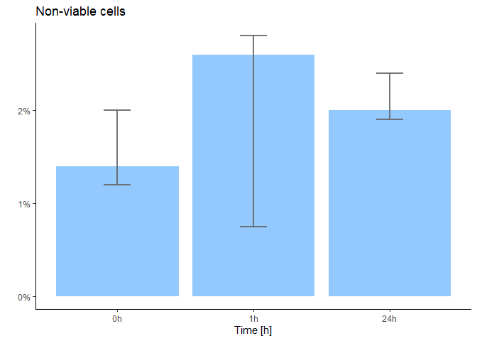<!-- -->

### Balken mit Zahlen

``` r
set.seed(2)

DF_balk <-
  data.frame(
    value = runif(2 * 5, min = 20, max = 80),
    sex = factor(rep(c("male", "female"), times = 5)),
    variable = factor(rep(
      c(
        n = "Neurotizismus",
        e = "Extraversion",
        o = "Offenheit",
        g = "Gewissenhaftigkeit",
        a = "Vertraeglichkeit"
      ),
      times = 2
    ))
  )

 
barchart(
  reorder(variable, value) ~ value,
  subset(DF_balk, sex == "male"),
  box.ratio = 2,
  xlim = c(-5, 100),
  origin = 0,
  #' par.settings=colorset,
  panel = function(...)   {
    panel.barchart(...)
    panel.barchart.text(..., digits = 1, suffix = " %")
  }
)
```

<!-- -->

### Tortendiagramme

``` r
# Create test data.
data <- data.frame(
  category=c("Granulocytes", "CD3+", "CD56+",  "CD19+", "Monocytes"),
  count=c(80,10,5,3,2)
)

# Compute percentages
data$fraction <- data$count / sum(data$count)
# Compute the cumulative percentages (top of each rectangle)
data$ymax <- cumsum(data$fraction)
# Compute the bottom of each rectangle
data$ymin <- c(0, head(data$ymax, n=-1))
# Compute label position
data$labelPosition <- (data$ymax + data$ymin) / 2
# Compute a good label
#data$label <- paste0(data$category, "\n value: ", data$count)

# Make the plot
ggplot(data, 
           aes(ymax=ymax, ymin=ymin, xmax=4, xmin=2, 
               fill=category)) +
  geom_rect() +
  # geom_text( x=2, 
  #            aes(y=labelPosition, 
  #                label=label, 
  #                color=1), size=6) + # x here controls label position (inner / outer)
  scale_fill_manual(
    values = 
      c("#918E00","#00F801","#FF2600","#0433FF","#FE9300")) +
 coord_polar(theta="y") +
  xlim(c(-1, 4)) +
 theme_void() +
  theme(legend.position = "top") +
  labs(title = "Leukocyte composition 1h NMP") +
  theme(legend.title = element_blank(),# element_text(size=12, color = "salmon", face="bold"),
        legend.justification=c(0,1), 
        legend.position=c(0.4, 0.7),
        legend.background = element_blank(),
        legend.key = element_blank()
        )  
```

    ## Warning: A numeric `legend.position` argument in `theme()` was deprecated in ggplot2
    ## 3.5.0.
    ## ℹ Please use the `legend.position.inside` argument of `theme()` instead.
    ## This warning is displayed once every 8 hours.
    ## Call `lifecycle::last_lifecycle_warnings()` to see where this warning was
    ## generated.

<!-- -->

    #  Geht nicht problemlos in Markdown
    print(torte(~treatment+sex, DF, init.angle=45, main="lattice"))

``` r
 gtorte(~treatment+sex, DF, init.angle=45, main="ggplot")
```

<!-- -->

    #  Geht nicht problemlos in Markdown
    tab <- as.data.frame(xtabs( ~ treatment + sex, DF))
    # par(new = TRUE)

      stp25plot::piechart(~Freq|sex, 
      tab, groups= treatment,
      auto.key=list(columns=3))
      

### MetComp_BAP

Tukey Mean Difference oder auch Bland Altman Metode

``` r
require(stp25metcomp)
```

    ## Loading required package: stp25metcomp

``` r
require(stp25metcomp)
x<- MetComp_BAP(~A+B, DF2)
plot(x)
```

<!-- -->

``` r
x
```

    ## 
    ##  
    ##                Parameter   Unit                 CI    SE Percent
    ## 1               df (n-1)     29               <NA>              
    ## 2    difference mean (d) -27.50  [-40.17,  -14.83]  6.20   <0.1%
    ## 3 standard deviation (s)  33.94               <NA>         39.8%
    ## 4  critical.diff (1.96s)  66.52               <NA>         78.0%
    ## 5                d-1.96s -94.02 [-115.97,  -72.07] 10.73   <0.1%
    ## 6                d+1.96s  39.02    [17.07,  60.97] 10.73  117.8%

### Sparkplot

Stolen from <http://www.motioninsocial.com/tufte/#sparklines>

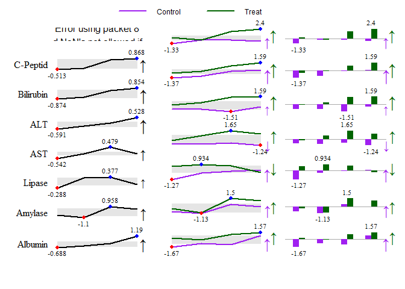<!-- -->

## Combine Multiple Plots

### patchwork

<https://patchwork.data-imaginist.com/articles/guides/layout.html>

### cowplot

gridExtra::grid.arrange( )

Zusammen mixen von unterschiedlichen Grafik-Typen.

The cowplot package is a simple add-on to ggplot.
<https://wilkelab.org/cowplot/articles/index.html>

``` r
library(ggplot2)
library(grid)
library(gridExtra)
library(cowplot)

theme_set(theme_half_open())
set.seed(0815)
# Create example data
data <-
  data.frame(x = 1:21,
             y = rnorm(21),
             group = rep(letters[1:3], 7))
# Create ggplot2 plot
p1 <-
  ggplot(data, aes(x, y, color = group)) +    
  geom_point(size = 5) +
  geom_line() # Draw default ggplot2 plot

p2 <- ggplot(data, aes(x, group , color = group)) + geom_boxplot()

title <-
  ggdraw() +
  draw_label("Arrange Plots", fontface = 'bold')

p1 <- p1 +
  guides(colour = guide_legend(
    title = "legend title",
    override.aes =
      list(
        size =  5,
        fill = NA,
        linetype = 0
      )
  )) +
  theme(legend.position  = c(.2, .5))

legend <- get_legend(p1)
```

    ## Warning in get_plot_component(plot, "guide-box"): Multiple components found;
    ## returning the first one. To return all, use `return_all = TRUE`.

``` r
p1 <- p1 +
  theme(legend.position = "none")

p2 <- p2 +
  theme(legend.position = "none")

p2 <-
  plot_grid(p2,
            legend,
            ncol = 1,
            rel_heights = c(1, .5))

plot_grid(
  title, NULL,
  p1,      p2,
  nrow = 2,
  rel_widths =  c(1, .6),
  rel_heights = c(0.2, 1)
)
```

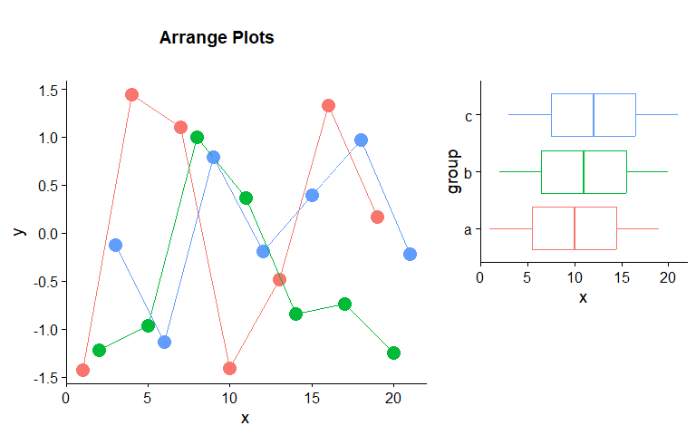<!-- -->

``` r
#require(ggplot2)
#require(cowplot)
#require(lattice)
p1<- ggplot(iris, aes(Sepal.Length, fill = Species)) +
  geom_density(alpha = 0.5) +
  scale_y_continuous(expand = expansion(mult = c(0, 0.05))) +
  theme_minimal_hgrid(10)
p2<- densityplot(~Sepal.Length|Species , iris)

plot_grid(p1, p2,  rel_widths = c(1, 1.5)
           , labels = c('A', 'B'))
```

<!-- -->

### Mixing different plotting frameworks

``` r
# require(ggplot2)
# require(cowplot)
# require(lattice)
 require(gridGraphics)
```

    ## Loading required package: gridGraphics

``` r
p1 <- function() {
  par(
    mar = c(3, 3, 1, 1),
    mgp = c(2, 1, 0)
  )
  boxplot(mpg ~ cyl, xlab = "cyl", ylab = "mpg", data = mtcars)
}

ggdraw(p1) +
  theme(plot.background = element_rect(fill = "cornsilk"))
```

<!-- -->

## ggformula

Quelle
<https://rpruim.github.io/Statistical-Rethinking/Examples/ggformula.html>

*gf_point()* for scatter plots

*gf_line()* for line plots (connecting dots in a scatter plot)

*gf_density()* or *gf_dens()* or *gf_histogram()* or *gf_freqpoly()* to
display distributions of a quantitative variable

*gf_boxplot()* or *gf_violin()* for comparing distributions side-by-side

*gf_counts()* for bar-graph style depictions of counts.

*gf_bar()* for more general bar-graph style graphics

``` r
require(ggformula)
```

    ## Loading required package: ggformula

    ## Loading required package: scales

    ## Loading required package: ggridges

    ## 
    ## New to ggformula?  Try the tutorials: 
    ##  learnr::run_tutorial("introduction", package = "ggformula")
    ##  learnr::run_tutorial("refining", package = "ggformula")

``` r
#require(lattice)
#require(ggplot2) 
theme_set(theme_bw())

mtcars2 <- within(mtcars, {
  vs <- factor(vs, labels = c("V-shaped", "Straight"))
  am <- factor(am, labels = c("Automatic", "Manual"))
  cyl  <- factor(cyl)
  gear <- factor(gear)
})

#' ggplot
p1 <- 
  ggplot(mtcars2) +
  geom_point(aes(x = wt, y = mpg, colour = gear)) +
  labs(
    title = "Fuel economy declines as weight increases",
    subtitle = "(1973-74)",
    caption = "Data from the 1974 Motor Trend US magazine.",
    tag = "ggplot",
    x = "Weight (1000 lbs)",
    y = "Fuel economy (mpg)",
    colour = "Gears"
  )

#' ggformula
p2 <-  
  gf_point(mpg ~ wt , data = mtcars2, color = ~ gear) +
  labs(
    title = "Fuel economy declines as weight increases",
    subtitle = "(1973-74)",
    caption = "Data from the 1974 Motor Trend US magazine.",
    tag = "ggformula::gf_point",
    x = "Weight (1000 lbs)",
    y = "Fuel economy (mpg)",
    colour = "Gears"
  )

#' lattice 
p3 <- 
  xyplot(
    mpg ~ wt,
    mtcars2,
    groups = gear,
    par.settings = bw_theme(farbe(), cex.main = .8, cex.add = .8),
    grid=TRUE,
    main = "Fuel economy declines as weight increases\n(1973-74)",
    sub =  "Data from the 1974 Motor Trend US magazine.",
    xlab = "Weight (1000 lbs)",
    ylab = "Fuel economy (mpg)",
    auto.key = list(space = "right", title = "Gears")
    
  )

cowplot::plot_grid(p1, p2, p3, ncol=2)
```

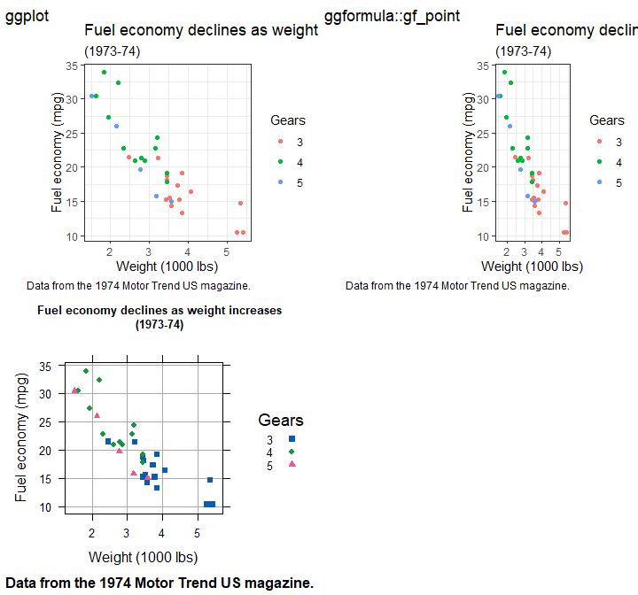<!-- -->

## Effectplot

### Meine Version vs plot.efflist

Die Effectplots habe ich aus dem Package ‘effects’ übernommen, jedoch
die Übergabe der Attribute angepasst, um die Formatierung zu
vereinfachen.

``` r
# Klassiker
plot( effects::allEffects(fit2) )
```

<!-- -->

``` r
# neue Version
plot2( effects::allEffects(fit2) )
```

<!-- -->

``` r
e2 <- effects::allEffects(fit2)
p1 <- plot2(e2,
            axes =  list(
              x = list(
                hp = list(lab = "Gross horsepower"),
                wt = list(lab = "Weight (1000 lbs"),
                am = list(lab = "Transmission (0 = automatic, 1 = manual)"),
                cyl_ord = list(lab = "Number of cylinders"),
                cex = .75
              ),
              y = list(lab = "Miles/(US) gallon")
            )
)
```

``` r
p2 <- plot2(e2, 
            labels = stp25tools::get_label(mtcars2), 
            plot = FALSE)

cowplot::plot_grid(
  plotlist = p2,
  labels = c('A', 'B', 'C'),
  # scale = c(1, .9, .8),
  rel_heights = c(3, 4)
)
```

<!-- -->

``` r
top_row <- cowplot::plot_grid(p2[[1]], p2[[2]], labels = c('B', 'C'), label_size = 12)
cowplot::plot_grid(top_row, p2[[3]], labels = c('', 'A'), label_size = 12, ncol = 1)
```

<!-- -->

``` r
library(multipanelfigure)

figure1 <- multi_panel_figure(columns = 4, rows = 2, panel_label_type = "none")
# show the layout
figure1
```

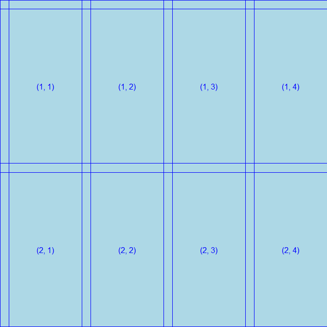<!-- -->

``` r
figure1 %<>%
  fill_panel(p2[[1]], column = 1:2, row = 1) %<>%
  fill_panel(p2[[2]], column = 3:4, row = 1) %<>%
  fill_panel(p2[[3]], column = 1:3, row = 2)  
```

    ## Warning in grabDL(warn, wrap, wrap.grobs, ...): one or more grobs overwritten
    ## (grab WILL not be faithful; try 'wrap.grobs = TRUE')

``` r
figure1
```

<!-- -->

Konfidenz-Band mit *geom_ribbon()*

``` r
ef1 <-
  as.data.frame(
    effects::effect(term = "hp", fit,
                    xlevels = list(
                      hp = seq(50, 350, by =10))))
```

    ## NOTE: hp is not a high-order term in the model

``` r
p1 <- ggplot(ef1, aes(hp, fit)) +
  geom_line() +
  geom_ribbon(aes(ymin = lower, ymax = upper), alpha = 0.3) +
  labs(y = 'Miles/(US) gallon',
       x = 'Gross horsepower',
       title = 'Main-Effect-Plot') +
  theme_classic()
```

Interaction mit *geom_line()*

``` r
ef2 <- as.data.frame(effects::effect("hp:wt", fit))

ef2$Weight <- factor(ef2$wt)

p2 <- ggplot(ef2, aes(hp, fit, col = Weight)) +
  geom_line() +
  labs(y = 'Miles/(US) gallon',
       x = 'Gross horsepower',
       title = 'Interaction-Plot') +
  theme_classic()
```

Fehlerbalken mit \*\*

``` r
#ef3<-  as.data.frame(effects::effect("am", fit))
 
ef4 <-  as.data.frame(effects::effect("cyl_ord", fit2))
p3 <- ggplot(ef4, aes(cyl_ord, fit, group=1 )) +
  geom_point()+
  geom_line()+
  geom_errorbar(
    aes(x = cyl_ord,
        ymin = lower,
        ymax = upper),
    width = 0.2,
    colour = "gray40",
    alpha = 0.9,
    linewidth = .75
  ) +   labs(y = 'Miles/(US) gallon',
             x = 'Number of cylinders',
             title = 'Cylinder Ordinal (nicht linear)')  +
  theme_classic()

ef4 <-  as.data.frame(effects::effect("cyl", fit))
p4 <- ggplot(ef4, aes(cyl, fit, group=1 )) +
  geom_point()+
  geom_line()+
  geom_errorbar(
    aes(x = cyl,
        ymin = lower,
        ymax = upper),
    width = 0.2,
    colour = "gray40",
    alpha = 0.9,
    linewidth = .75
  ) +   labs(y = 'Miles/(US) gallon',
             x = 'Number of cylinders ',
             title = 'Cylinder Metrisch (linear)')  +
  ylim(c(8,23))+
 # xlim(c(4, 8))+
  annotate("text", x = 6, y=9, label =  stp25stat2::APA(fit)) +
  theme_classic()
```

``` r
library(patchwork)
```

    ## 
    ## Attaching package: 'patchwork'

    ## The following object is masked from 'package:cowplot':
    ## 
    ##     align_plots

``` r
p1 + p2 + p3 + p4 +
  plot_layout(ncol=2)
```

<figure>

<figcaption aria-hidden="true">Effect ggplot</figcaption>
</figure>

### ggeffects

    require(ggeffects)

    ggeffect() 
    # computes marginal effects by internally calling  effects::Effect()

    ggemmeans() 
    # uses emmeans::emmeans()

    ggpredict() 
    # uses predict() 

    ggpredict(fit, term = "hp") |> plot() +
    ggeffect(fit, term = "hp")  |> plot( add.data = TRUE) +
    ggemmeans(fit,term = "hp") |> plot(log.y = TRUE) 

    ## S3 method for class 'ggeffects'
    plot(
      x,
      ci = TRUE,
      ci.style = c("ribbon", "errorbar", "dash", "dot"),
      facets,
      add.data = FALSE,
      limit.range = FALSE,
      residuals = FALSE,
      residuals.line = FALSE,
      collapse.group = FALSE,
      colors = "Set1",
      alpha = 0.15,
      dodge = 0.25,
      use.theme = TRUE,
      dot.alpha = 0.35,
      jitter = 0.2,
      log.y = FALSE,
      case = NULL,
      show.legend = TRUE,
      show.title = TRUE,
      show.x.title = TRUE,
      show.y.title = TRUE,
      dot.size = NULL,
      line.size = NULL,
      connect.lines = FALSE,
      grid,
      one.plot = TRUE,
      rawdata,
      ...
    )

Quelle: <https://strengejacke.github.io/ggeffects/>

Die lib *ggeffects()* berechnet die Marginalen Effecte bei Interactionen
anderst als *effect()*, daher aufpassen!!

``` r
ef1 <-
  as.data.frame(effects::effect(term = "hp", fit,
                                xlevels = list(hp = c(
                                  50, 85, 120, 155, 195, 230, 265, 335
                                ))))
```

    ## NOTE: hp is not a high-order term in the model

``` r
 effects::effect(term = "hp", 
                 fit,
                 xlevels = 
                   list(hp = 
                          c(50, 85, 120, 155, 195, 230, 265, 335)))
```

    ## NOTE: hp is not a high-order term in the model

    ## 
    ##  hp effect
    ## hp
    ##       50       85      120      155      195      230      265      335 
    ## 13.62688 14.07651 14.52613 14.97576 15.48962 15.93925 16.38888 17.28814

``` r
ggpredict(fit, term = "hp") 
```

    ## # Predicted values of Miles/(US) gallon
    ## 
    ##  hp | Predicted |       95% CI
    ## ------------------------------
    ##  50 |     15.56 | 10.99, 20.13
    ##  85 |     16.01 | 12.73, 19.28
    ## 120 |     16.46 | 13.87, 19.04
    ## 155 |     16.91 | 13.94, 19.87
    ## 195 |     17.42 | 13.09, 21.75
    ## 230 |     17.87 | 12.04, 23.70
    ## 265 |     18.32 | 10.88, 25.77
    ## 335 |     19.22 |  8.42, 30.02
    ## 
    ## Adjusted for:
    ## *  wt =      3.22
    ## *  am = automatic
    ## * cyl =      6.19

    ## 
    ## Not all rows are shown in the output. Use `print(..., n = Inf)` to show
    ##   all rows.

``` r
ggeffect(fit,term = "hp")
```

    ## # Predicted values of Miles/(US) gallon
    ## 
    ##  hp | Predicted |       95% CI
    ## ------------------------------
    ##  50 |     13.63 |  8.28, 18.97
    ##  85 |     14.08 | 10.25, 17.90
    ## 120 |     14.53 | 11.90, 17.15
    ## 155 |     14.98 | 12.68, 17.28
    ## 195 |     15.49 | 12.18, 18.80
    ## 230 |     15.94 | 11.19, 20.69
    ## 265 |     16.39 | 10.05, 22.73
    ## 335 |     17.29 |  7.59, 26.99

    ## 
    ## Not all rows are shown in the output. Use `print(..., n = Inf)` to show
    ##   all rows.

``` r
ggemmeans(fit,term = "hp")
```

    ## NOTE: Results may be misleading due to involvement in interactions

    ## # Predicted values of Miles/(US) gallon
    ## 
    ##  hp | Predicted |       95% CI
    ## ------------------------------
    ##  50 |     13.18 |  7.54, 18.82
    ##  85 |     13.63 |  9.50, 17.76
    ## 120 |     14.08 | 11.17, 16.99
    ## 155 |     14.53 | 12.08, 16.98
    ## 195 |     15.04 | 11.77, 18.32
    ## 230 |     15.49 | 10.86, 20.12
    ## 265 |     15.94 |  9.76, 22.13
    ## 335 |     16.84 |  7.33, 26.35
    ## 
    ## Adjusted for:
    ## *  wt = 3.22
    ## * cyl = 6.19

    ## 
    ## Not all rows are shown in the output. Use `print(..., n = Inf)` to show
    ##   all rows.

``` r
mydf <- ggpredict(fit, terms = "hp")
p2 <- ggplot(mydf, aes(x, predicted)) +
  geom_line() +
  geom_ribbon(aes(ymin = conf.low, ymax = conf.high), alpha = .1) +
  theme_classic()

mydf <- ggpredict(fit, terms = c("hp", "wt"))

 
p3 <- ggplot(mydf, aes(x = x, y = predicted, colour = group)) +
  geom_line()


p4 <- ggplot(mydf,
             aes(x = x, y = predicted)) +
               geom_line() +
               facet_wrap( ~ group)
```

``` r
library(patchwork)
p1 + p2 + p3 + p4 + plot(mydf) +
    plot_layout(ncol=2)
```

<!-- -->

``` r
require(ggeffects)

mod <- lm(prestige ~ type*(education + income) + women, Prestige)
mydf<-ggpredict(mod, terms =c( "education", "type"))
mydf
```

    ## # Predicted values of prestige
    ## 
    ## type: bc
    ## 
    ## education | Predicted |       95% CI
    ## ------------------------------------
    ##         6 |     34.90 | 29.62, 40.18
    ##         8 |     38.24 | 35.80, 40.69
    ##         9 |     39.92 | 37.57, 42.26
    ##        11 |     43.26 | 38.20, 48.33
    ##        13 |     46.61 | 38.01, 55.20
    ##        16 |     51.62 | 37.52, 65.72
    ## 
    ## type: prof
    ## 
    ## education | Predicted |       95% CI
    ## ------------------------------------
    ##         6 |     40.10 | 26.70, 53.51
    ##         8 |     46.13 | 35.99, 56.27
    ##         9 |     49.15 | 40.61, 57.68
    ##        11 |     55.18 | 49.68, 60.67
    ##        13 |     61.21 | 57.99, 64.42
    ##        16 |     70.25 | 65.41, 75.08
    ## 
    ## type: wc
    ## 
    ## education | Predicted |       95% CI
    ## ------------------------------------
    ##         6 |     17.31 |  1.88, 32.74
    ##         8 |     27.59 | 18.00, 37.18
    ##         9 |     32.73 | 25.94, 39.52
    ##        11 |     43.00 | 40.04, 45.96
    ##        13 |     53.28 | 46.64, 59.92
    ##        16 |     68.69 | 53.43, 83.96
    ## 
    ## Adjusted for:
    ## * income = 6035.50
    ## *  women =   28.99

    ## 
    ## Not all rows are shown in the output. Use `print(..., n = Inf)` to show
    ##   all rows.

``` r
# ggplot(mydf, aes(x, predicted)) +
#   geom_line() +
#   geom_ribbon(aes(ymin = conf.low, ymax = conf.high), alpha = .1)

p1 <-plot(mydf)
p1
```

<!-- -->

``` r
p1 +
  facet_wrap(~group)  +
  theme(legend.position = "none")
```

<!-- -->

``` r
#plot(allEffects(mod))

ggplot(mydf, aes(x = x, y = predicted, group =group)) +
  geom_line() + 
  geom_ribbon(aes(ymin = conf.low, ymax = conf.high), alpha = .1) +
  facet_wrap(~group)
```

<!-- -->

    theme_set(theme_ggeffects())
    p1<-ggpredict(fit, "am") |>
      plot(
        connect.lines = TRUE,
        ci=FALSE,
        dot.size = 5)+ geom_errorbar(
        aes_string(ymin = "conf.low",
                            ymax = "conf.high"),
        width = 0.099#,
        #size = line.size
      ) +
      theme_classic() 

    p1

### Effectplot mit emmeans

``` r
require(emmeans)
head(pigs)
```

    ##   source percent conc
    ## 1   fish       9 27.8
    ## 2   fish       9 23.7
    ## 3   fish      12 31.5
    ## 4   fish      12 28.5
    ## 5   fish      12 32.8
    ## 6   fish      15 34.0

``` r
pigs.lm1 <- lm(log(conc) ~ source + factor(percent), data = pigs)
ref_grid(pigs.lm1)
```

    ## 'emmGrid' object with variables:
    ##     source = fish, soy, skim
    ##     percent =  9, 12, 15, 18
    ## Transformation: "log"

``` r
pigs.lm2 <- lm(log(conc) ~ source + percent, data = pigs)
ref_grid(pigs.lm2)
```

    ## 'emmGrid' object with variables:
    ##     source = fish, soy, skim
    ##     percent = 12.931
    ## Transformation: "log"

#### emmeans default

``` r
plot(emmeans(pigs.lm1,  
             ~ percent | source))
```

<!-- -->

#### emmeans ruecktransformiert

``` r
plot(emmeans(pigs.lm1,  
             ~ percent | source),
             xlab= "plasma leucine [mcg/ml]" , 
             type = "response")
```

<!-- -->

``` r
emmip(pigs.lm1, 
      source ~ percent)
```

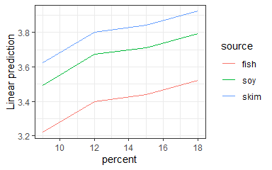<!-- -->

``` r
plot(emmeans(pigs.lm2,  
             ~ percent | source, 
             at = list(percent = c(10, 15, 20))
             )
     )
```

<!-- -->

``` r
emmip(
  ref_grid(pigs.lm2, cov.reduce = FALSE), 
  source ~ percent)
```

<!-- -->

``` r
emmip(ref_grid(pigs.lm2, 
               at= list(percent = c(10, 15, 20))), 
      source ~ percent,
      ylab= "plasma leucine [mcg/ml]" , 
      type = "response"
      )
```

<!-- -->

### Klassiker mit Effect()

#### predictorEffect()

Von mir lang ignorierte Variante von Effect mit Formeln!

``` r
mod <- lm(prestige ~ type*(education + income) + women, Prestige)
plot(predictorEffect("income", mod), main="", rug=FALSE)
```

<!-- -->

``` r
plot(predictorEffects(mod, ~ education + women), main="", rug=FALSE)
```

<!-- -->

``` r
plot(predictorEffects(mod, ~ women+ education),
     axes= list(x=list( women=list(lab="Anteil Frauen"),
                        education=list(lab="Bildung"))), main="", rug=FALSE)
```

<!-- -->

#### Modifizier plot.efflist

#### allEffects

``` r
ef <- allEffects(lm(A ~ B + C))
plot(ef,
     axes = list(
       x = list(
        B = list(
         transform = list(trans = log, inverse = exp),
         ticks = list(at = c(30, 50, 70)),
         lab = "Age, log-scale"),
       C = list(lab = "Treatment")
      ),
     y = list(lim= c(.0, 2.5),
              lab = "Vitamins"
              #  transform = list(link = Logit, inverse = invLogit),
              #  transform=list(trans=log, inverse=exp),
              #  type="rescale",
              #  ticks = list(at = c(.05, .25, .50, .75)),
              #   
       )),
     main = "")
```

<!-- -->

``` r
 lattice::trellis.par.set(bw_theme(farbe()))
plot(Effect(c("source", "percent"), 
            pigs.lm2,
            transformation=list(link=log, inverse=exp)),
     multiline=TRUE,
     key.args = list(space="right" ),
     main="", 
     ylab="plasma leucine [mcg/ml]") 
```

<!-- -->

``` r
pigs.lm3 <- lm(log(conc) ~ source * percent, data = pigs)

plot(
  allEffects(pigs.lm3),
  main = "",
  multiline = TRUE,
  key.args = list(
    space = "right", columns = 1,
    border = FALSE,
    fontfamily = "serif",
    cex.title = .80,  cex = 0.75
  )
)
```

<!-- -->

``` r
emmip(
  ref_grid(pigs.lm3, cov.reduce = TRUE), 
  source ~ percent)
```

    ## Suggestion: Add 'at = list(percent = ...)' to call to see > 1 value per group.

    ## `geom_line()`: Each group consists of only one observation.
    ## ℹ Do you need to adjust the group aesthetic?

<!-- -->

``` r
emmip(
  ref_grid(pigs.lm3, cov.reduce = FALSE), 
  source ~ percent)
```

<!-- -->

``` r
raw_data <-
  data.frame(
    subject_id = rep(1:6, 4),
    time = as.factor(rep(c("t0", "t1"), each = 12)),
    group = rep(rep(c("Control", "Treat"), each = 6), 2),
    value = c(2:7, 6:11, 3:8, 7:12)
  )


head(raw_data)
```

    ##   subject_id time   group value
    ## 1          1   t0 Control     2
    ## 2          2   t0 Control     3
    ## 3          3   t0 Control     4
    ## 4          4   t0 Control     5
    ## 5          5   t0 Control     6
    ## 6          6   t0 Control     7

``` r
stripplot(
  value ~ time | group,
  groups = subject_id,
  data = raw_data,
  panel = function(x, y, ...) {
    panel.stripplot(x, y, 
                    type =  "b", 
                    col="blue",
                    lty = 2, ...)
       panel.average(x, y, fun = mean, lwd = 2, col = "gray80", ...)    # plot line connecting means
       mm<-mean(y) 
       panel.abline(h=mm, v=1.5, col="gray80")
       panel.text(x=1.5,y=mm, APA(wilcox.test(y~x)) )
       
   
   
  }
)
```

    ## Warning in wilcox.test.default(x = DATA[[1L]], y = DATA[[2L]], ...): cannot
    ## compute exact p-value with ties
    ## Warning in wilcox.test.default(x = DATA[[1L]], y = DATA[[2L]], ...): cannot
    ## compute exact p-value with ties

<!-- -->

#### transformation

require(effects) John Fox URL <http://www.jstatsoft.org/v32/i01/>

``` r
fit <- lm(y ~ group * time * serum, DF)
```

``` r
plot(effects::allEffects(fit)) 
```

<!-- -->

``` r
Tbll_desc( ~ log(prestige) + income + type + education,
      data = Prestige)
```

    ## # A tibble: 7 × 3
    ##   Item               n     m             
    ## * <chr>              <chr> <chr>         
    ## 1 "prestige (mean)"  "102" "3.77 (0.39)" 
    ## 2 "income (mean)"    "102" "6798 (4246)" 
    ## 3 "type "            "98"  ""            
    ## 4 "    bc"           ""    "45% (44)"    
    ## 5 "    prof"         ""    "32% (31)"    
    ## 6 "    wc"           ""    "23% (23)"    
    ## 7 "education (mean)" "102" "10.74 (2.73)"

``` r
mod <- lm(log(prestige) ~ income:type + education, data = Prestige)

# does not work: effect("income:type", mod, transformation=list(link=log, inverse=exp))

plot(Effect(c("income", "type"), mod,
            transformation=list(link=log, inverse=exp)),
     main="", ylab="prestige") 
```

<!-- -->

## GOF-Plots

``` r
require(car)
```

    ## Loading required package: car

``` r
car::residualPlots(fit) 
```

<figure>

<figcaption aria-hidden="true">residualPlots</figcaption>
</figure>

    ##            Test stat Pr(>|Test stat|)
    ## group                                
    ## time                                 
    ## serum        -0.3948           0.6957
    ## Tukey test   -0.6940           0.4877

``` r
car::marginalModelPlots(fit) 
```

<figure>

<figcaption aria-hidden="true">marginalModelPlots</figcaption>
</figure>

    ## Warning in mmps(...): Interactions and/or factors skipped

``` r
car::avPlots(fit) 
```

<figure>

<figcaption aria-hidden="true">avPlots</figcaption>
</figure>

### library(visreg)

Patrick Breheny and Woodrow Burchett URL:
<https://cran.r-project.org/web/packages/visreg/vignettes/quick-start.html>

Limitation: plot kann nicht einfach in cowplot::plot_grid integriert
werdrn.

``` r
par(mfrow=c(1,3))
visreg::visreg(fit)
```

    ## Conditions used in construction of plot
    ## time: 1
    ## serum: -0.215

    ## Conditions used in construction of plot
    ## group: Ctl_gt
    ## serum: -0.215

    ## Conditions used in construction of plot
    ## group: Ctl_gt
    ## time: 1

<figure>

<figcaption aria-hidden="true">visreg</figcaption>
</figure>

### library(stats) termplot

``` r
par(mfrow=c(1,3))
stats::termplot(fit, 
                se = TRUE, 
                resid = TRUE, 
                plot=TRUE, ask=FALSE)
```

<figure>

<figcaption aria-hidden="true">termplot</figcaption>
</figure>

library(rockchalk) Paul E. Johnson URL
<https://github.com/pauljohn32/rockchalk>

Hier gibt es keine Updates mehr???

    rockchalk::plotSlopes(fit, 
                          plotx = "group", 
                          interval = "confidence")

    rockchalk::plotSlopes(fit, 
                          plotx = "group", 
                          modx = "time", 
                          interval = "confidence")

``` r
raw_data <-
  data.frame(
    subject_id = rep(1:6, 4),
    time = as.factor(rep(c("t0", "t1"), each = 12)),
    group = rep(rep(c("Control", "Treat"), each = 6), 2),
    value = c(2:7, 6:11, 3:8, 7:12)
  )
head(raw_data)
```

    ##   subject_id time   group value
    ## 1          1   t0 Control     2
    ## 2          2   t0 Control     3
    ## 3          3   t0 Control     4
    ## 4          4   t0 Control     5
    ## 5          5   t0 Control     6
    ## 6          6   t0 Control     7

``` r
stripplot(
  value ~ time | group,
  groups = subject_id,
  data = raw_data,
  panel = function(x, y, ...) {
    panel.stripplot(x,
                    y,
                    type =  "b",
                    col = "blue",
                    lty = 2,
                    ...)
    panel.average(x,
                  y,
                  fun = mean,
                  lwd = 2,
                  col = "gray80",
                  ...)    # plot line connecting means
    mm <- mean(y)
    panel.abline(h = mm, v = 1.5, col = "gray80")
    panel.text(x = 1.5, y = mm, APA(wilcox.test(y ~ x)))
  
  }
)
```

    ## Warning in wilcox.test.default(x = DATA[[1L]], y = DATA[[2L]], ...): cannot
    ## compute exact p-value with ties
    ## Warning in wilcox.test.default(x = DATA[[1L]], y = DATA[[2L]], ...): cannot
    ## compute exact p-value with ties

<!-- -->

## Altman and Bland (Tukey Mean-Difference Plot)

``` r
 # A - Goldstandart

x <- MetComp_BAP(~A+B, Giavarina)
#> Warning: Warning in bland.altman.stats:Mehr als 2 Methoden.
# x |> Output("BA-Analyse der Messwertreihe")
plot(x)
```

<figure>
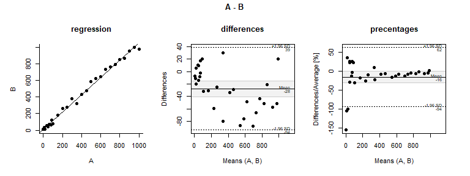
<figcaption aria-hidden="true">Bland Altman</figcaption>
</figure>

``` r
lattice::tmd( A ~ B, Giavarina)
```

<figure>

<figcaption aria-hidden="true">Bland Altman</figcaption>
</figure>

## Survival Analysis

Add number-at-risk annotations to a plot

``` r
require("survival")

s <- Surv(colon$time / 365, colon$status)

## Need to increase margins a bit
par(mar = c(10, 6, 2, 1),mfrow = c(1,2))

## no stratification
fit1 <- survfit(s ~ 1)
plot(fit1)
addNrisk(fit1)

## with stratification
at <- c(0, 2, 4)
lty <- 1:3
xlim <- c(0, 6)
fit2 <- survfit(s ~ rx, data = colon)
plot(fit2,
     xlab = 'Time (years)',
     ylab = 'Survival',
     xaxt = "n",
     xlim=xlim,
     lty = lty)

addNrisk(fit2, at)
axis(1, at = at, gap.axis = 1 / 4)
legend(
  'bottomleft',
  legend = names(fit2$strata),
  lty = lty,
  bty = 'n'
)
Hmisc::minor.tick(nx = 4, tick.ratio = 1 / 2)
```

<!-- -->

## ECDF-Plot

ecdfplot {latticeExtra}

``` r
 # data(Chem97, package = "mlmRev")
 # 
 # ecdfplot(~gcsescore | factor(score), data = Chem97,
 #     groups = gender, 
 #     auto.key = list(columns = 2), 
 #     subset = gcsescore > 0, 
 #     xlab = "Average GCSE Score")

data(singer, package = "lattice")
ecdfplot(~height | voice.part, data = singer)
```

<!-- -->

data(singer, package = “lattice”)

## Interessante Grafik Beispiele

Lattice xyplot mit Pfeilen und verlaufende Farben.

``` r
dat <- stp25tools::get_data("
  variable        value change leverage
     happiness   4.62  -0.42    0.01
    motivation   3.6   -0.41    0.05
      training   3.4   -0.33    0.14
   performance   3.2    0.30    0.82
           lmx   2.96   0.21    0.33
 communication   2.9   -0.11    0.43
      autonomy   2.7    0.11    0.22
    insecurity   2.5    0.12    0.21
        stress   1.6    0.14    0.12")

#Create a function to generate a continuous color palette
rbPal <- colorRampPalette(c('gray','blue'))

xyplot(
  reorder(variable, value) ~ value ,
  xlab = "",  ylab = "",
  data = dat,
  xlim = c(0.85, 5.15),# drop.unused.levels = FALSE,
  scales = list(x = list(
     at = 1:5,
     labels = c( "low",  "moderate", "considerable", "hig","very high")
  )),
  panel = function(x, y, ...) {
    
    col <- rbPal(8)[as.numeric(cut(dat$leverage,breaks = 8))]
    
    panel.dotplot(
      x = x,  y = y,
      col = col,
      cex = 1.1 + 1 * dat$leverage,
      pch = 19
    )
    
    panel.arrows(
      x0 = x, y0 = y,
      x1 = x + x * dat$change, y1 = y,
      col=col, lwd = 2,
      angle = 30, code = 2, length = 0.1
    )
  }
)
```

<figure>

<figcaption aria-hidden="true">Lattice xyplot mit Pfeilen und
verlaufende Farben.</figcaption>
</figure>

``` r
# siehe panel.segplot
panel.arrows2 <- function(x0, y0 , x1, y1,
                          col, alpha, lty, lwd, ...) {
  panel.dotplot(
    x = x0,   y = y0,
    col = col,
    cex = 1.5,
    pch = "|"
  )
  panel.arrows(
    x0, y0, x1, y1,
    col = col ,
    alpha = alpha,
    lty = lty,
    lwd = lwd,
    ...
  )
  
  
  
}

dat$change <- dat$value + dat$change * dat$value
dat$centers <- (dat$value + dat$change) / 2
#require(latticeExtra)
segplot(
  reorder(variable, value) ~ value + change,
  level = leverage,
  data = dat,
  draw.bands = FALSE,
  centers = centers,
  segments.fun = panel.arrows2,
  lwd = 2,
  angle = 30,
  code = 2,
  length = 0.1,
  colorkey = TRUE,
  col.regions = rbPal# hcl.colors #terrain.colors
  
)
```

<!-- -->

### Spine Plots and Spinograms

``` r
require("colorspace")
```

    ## Loading required package: colorspace

    ## 
    ## Attaching package: 'colorspace'

    ## The following object is masked from 'package:pROC':
    ## 
    ##     coords

``` r
ttnc <- margin.table(Titanic, c(1, 4))
 
spineplot(ttnc, col = sequential_hcl(2, palette = "Purples 3"))
```

<!-- -->

``` r
# require(latticeExtra)
 segplot(factor(1:10) ~ rnorm(10) + rnorm(10), level = runif(10))
```

<!-- -->

``` r
 data(USCancerRates)
 
 segplot(reorder(factor(county), rate.male) ~ LCL95.male + UCL95.male,
         data = subset(USCancerRates, state == "Washington"))
```

<!-- -->

``` r
 segplot(reorder(factor(county), rate.male) ~ LCL95.male + UCL95.male,
         data = subset(USCancerRates, state == "Washington"),
         draw.bands = FALSE, 
         centers = rate.male)
```

<!-- -->

``` r
 segplot(reorder(factor(county), rate.male) ~ LCL95.male + UCL95.male,
         data = subset(USCancerRates, state == "Washington"),
         level = rate.female,
         col.regions = terrain.colors)
```

<!-- -->

``` r
 segplot(reorder(factor(county), rate.male) ~ LCL95.male + UCL95.male,
         data = subset(USCancerRates, state == "Washington"),
         draw.bands = FALSE, 
         centers = rate.male, 
         segments.fun = panel.arrows, 
         ends = "both", 
         angle = 90, 
         length = 1, 
         unit = "mm")
```

<!-- -->

``` r
 segplot(reorder(factor(county), rate.male) ~ LCL95.male + UCL95.male, 
         data = subset(USCancerRates, state ==  "Washington"), 
         draw.bands = FALSE, centers = rate.male)
```

<!-- -->

## Misc

Speichern von Grafiken als PDF scheitert wen Unicode verwendet wird
abhilfe bietet CairoPDF.

    require(Cairo)

    CairoPDF( paste0(Abb()[3],"-cell-count.pdf"),  width = 7, height =  0.66*8 +.4)
      plot_grid(p_all, p_cit, p_trns, p_dbd)
      
      invisible(dev.off())

## Links

<https://ggobi.github.io/ggally/index.html>

<http://www.sthda.com/english/articles/24-ggpubr-publication-ready-plots/78-perfect-scatter-plots-with-correlation-and-marginal-histograms/>

ggpubr

<http://www.sthda.com/english/articles/24-ggpubr-publication-ready-plots/78-perfect-scatter-plots-with-correlation-and-marginal-histograms/>
